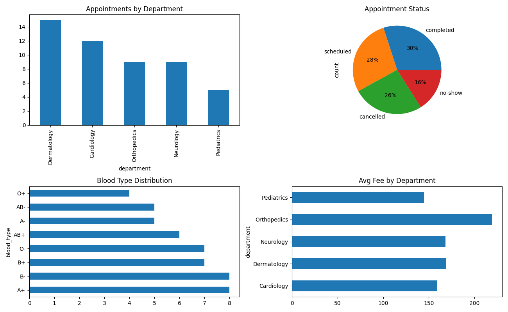

### Healthcare Data Pipeline with Apache Airflow 3.1.0

A containerized ETL pipeline that automatically generates, processes, and analyzes synthetic healthcare data with parallel task execution and visualization capabilities.

## Project Overview

This project demonstrates a production-ready data orchestration pipeline that:
- Generates synthetic patient and appointment data using the Faker library
- Processes and merges datasets in parallel
- Loads data into PostgreSQL database
- Performs data analysis with visualizations
- Cleans up intermediate files automatically

## Containerized Development Setup

Run the code mentioned below to create the following files:

- .devcontainer folder 
- docker-compose.yml file
- Dockerfile
- db.env file 
- .env file
- data folder
- config folder
- dags folder
- requirements.txt

``` 
mkdir -p .devcontainer data

touch  .devcontainer/docker-compose.yml .devcontainer/.Dockerfile  
```

# Create Database Configuration

```
cat <<EOF >> .devcontainer/db.env 
POSTGRES_DB=airflow_db
POSTGRES_USER=vscode
POSTGRES_PASSWORD=vscode
EOF 
```

# Create requirements.txt

```
cat <<EOF >> requirements.txt
Faker==37.12.0
apache-airflow-providers-postgres
EOF
```

# Build Docker image
```
cd .devcontainer
docker compose build --no-cache      
```  

# Start the containers and the setup
```
docker compose up -d
``` 

# Access Airflow UI

Open your browser to: [**http://localhost:8080**](http://localhost:8080)

**Login Credentials:**
- Username: `airflow`
- Password: `airflow`

# Configure PostgreSQL Connection

1. Navigate to **Admin → Connections** in the Airflow UI
2. Click **+ (Add Connection)**
3. Enter the following details:

| Field | Value |
|-------|-------|
| Connection Id | `Postgres` |
| Connection Type | Postgres |
| Host | `db` |
| Schema | `week8_demo` |
| Login | `vscode` |
| Password | `vscode` |
| Port | `5432` |

4. Click **Test Connection** to verify
5. Click **Save**

# Enable and Run the DAG

1. In the DAGs list, locate `healthcare_pipeline`
2. Toggle the switch to **ON**
3. Click the **▶ Play** button to trigger execution
4. Monitor progress in **Graph View**

The 'dags' folder in this repo has a file called 'healthcare.py' file that has the codes for doing ETL and visualization on healthcare data. 

# Task Flow

[fetch_patients, fetch_appointments] → merge_csvs → load_csv_to_pg
→ analyze_healthcare_data → cleanup_folder

## Healthcare pipeline

# ETL Task Group (`etl_group`)

**fetch_patients()**
- Generates 50 synthetic patient records using Faker
- Creates patient_id (UUID4), demographics, contact information
- Outputs: `patients.csv`


**fetch_appointments()**
- Generates 50 appointment records across 5 departments
- Creates appointment details with scheduling and billing info
- Outputs: `appointments.csv`
- Runs in parallel with `fetch_patients`


**merge_csvs()**
- Combines patient and appointment data (1:1 mapping)
- Extracts relevant fields for analysis
- Outputs: `merged_data.csv`


**load_csv_to_pg()**
- Creates PostgreSQL schema `week8_demo` if not exists
- Creates table `healthcare_records` with dynamic schema
- Loads merged data into PostgreSQL
- Uses `PostgresHook` for database connection
- Returns: Number of records loaded (50)

# Analysis Task Group (`analysis_group`)

**analyze_healthcare_data()**
- Reads `merged_data.csv` using Pandas
- Generates 4-panel matplotlib visualization (13x8 inches)
- Outputs: `dashboard.png`

**Visualizations:**
1. **Top-Left**: Appointments by Department (bar chart)
2. **Top-Right**: Appointment Status (pie chart with percentages)
3. **Bottom-Left**: Blood Type Distribution (horizontal bar)
4. **Bottom-Right**: Average Consultation Fee by Department (horizontal bar)

# Cleanup Task

**cleanup_folder()**
- Removes all CSV files from `/opt/airflow/data`
- Preserves `dashboard.png` for analysis review
- Runs after successful analysis completion

# Task Dependencies
etl_group >> analysis_group >> cleanup_folder()


After running The 'healthcare.py' file, you will see something like this:
 airflow.png>)

This tells you that the codes/tasks which you have in the healthcare.py file ran successfully.

The 'healthcare.py' file have codes which create data on appointments, and patients, analyses the data by merging those csv files and perform visualizations. 

The visualizations are found here: 



